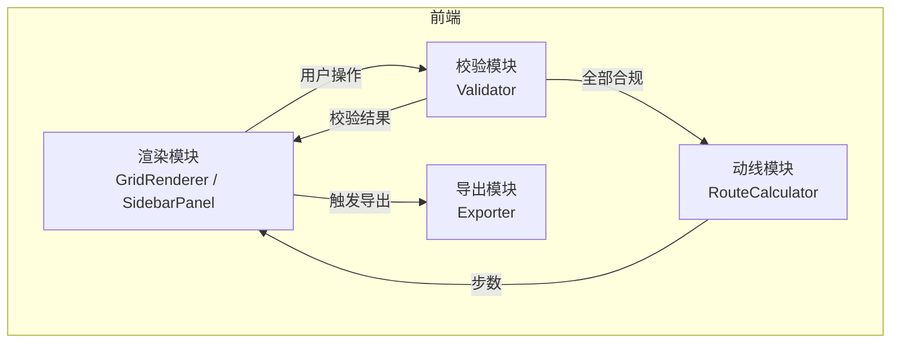

## 1. 架构设计



纯前端应用，无后端。渲染、校验、动线计算三模块解耦，通过 Zustand store 共享状态。

## 2. 技术说明

- **前端**：React@18 + TypeScript + Tailwind CSS@3 + Vite
- **初始化工具**：vite-init（react-ts 模板）
- **状态管理**：Zustand
- **后端**：无
- **部署**：Docker + Nginx 静态托管

## 3. 路由定义

| 路由 | 用途 |
|------|------|
| `/` | 席面摆位页（唯一页面） |

## 4. 模块设计

### 4.1 渲染模块（src/components）

| 组件 | 职责 |
|------|------|
| `TeaGrid` | 6×4 网格渲染，处理格子点击事件 |
| `GridCell` | 单格渲染，显示器具图标/入口/出口/空位 |
| `Sidebar` | 器具选择侧栏，四种器具按钮 |
| `ValidationPanel` | 三条校验规则实时显示 |
| `RouteDisplay` | 最短动线步数展示 |
| `ExportButton` | 导出按钮，触发 JSON 输出 |

### 4.2 校验模块（src/utils/validator.ts）

```
输入：GridState（6×4 格状态）
输出：ValidationResult（三条规则各自通过/失败 + 原因）

规则1：壶与公道曼哈顿距离 ≤ 3
规则2：杯与盂不得四向相邻
规则3：四器具格须构成单一四向连通块（BFS/DFS 判定）
```

### 4.3 动线模块（src/utils/routeCalculator.ts）

```
输入：四器具坐标
输出：最短动线步数

算法：
- 起点：左下角入口格 (row=3, col=0)
- 终点：右下角出口格 (row=3, col=5)
- 中间必须经过四器具各1次（顺序任意）
- 步数 = 曼哈顿路径最小值
- 枚举4! = 24种器具访问顺序
- 对每种顺序，累加相邻两点间曼哈顿距离
- 取24种中最小值即为答案

公式：min over σ∈S4 of [ dist(入口, σ₁) + dist(σ₁, σ₂) + dist(σ₂, σ₃) + dist(σ₃, σ₄) + dist(σ₄, 出口) ]
其中 dist 为曼哈顿距离
```

### 4.4 导出模块（src/utils/exporter.ts）

```
输入：GridState + ValidationResult + routeSteps
输出：JSON 字符串

格式：
{
  "placements": [
    { "id": "H", "name": "壶", "row": 0, "col": 0 },
    { "id": "G", "name": "公道", "row": 0, "col": 2 },
    { "id": "B", "name": "杯", "row": 1, "col": 1 },
    { "id": "Y", "name": "盂", "row": 2, "col": 3 }
  ],
  "routeSteps": 12
}
```

### 4.5 状态模型（src/store/gridStore.ts）

```typescript
type UtensilId = 'H' | 'G' | 'B' | 'Y';
type CellValue = UtensilId | null;
type GridState = CellValue[][]; // 4 rows × 6 cols

interface TeaStore {
  grid: GridState;
  selectedUtensil: UtensilId;
  selectUtensil: (id: UtensilId) => void;
  placeUtensil: (row: number, col: number) => void;
  clearCell: (row: number, col: number) => void;
}
```

## 5. Docker 部署

```dockerfile
# 构建阶段
FROM node:20-alpine AS build
WORKDIR /app
COPY package*.json ./
RUN npm ci
COPY . .
RUN npm run build

# 发布阶段
FROM nginx:alpine
COPY --from=build /app/dist /usr/share/nginx/html
COPY nginx.conf /etc/nginx/conf.d/default.conf
EXPOSE 80
```

nginx.conf 配置 SPA 回退：
```
server {
    listen 80;
    root /usr/share/nginx/html;
    index index.html;
    location / {
        try_files $uri $uri/ /index.html;
    }
}
```
